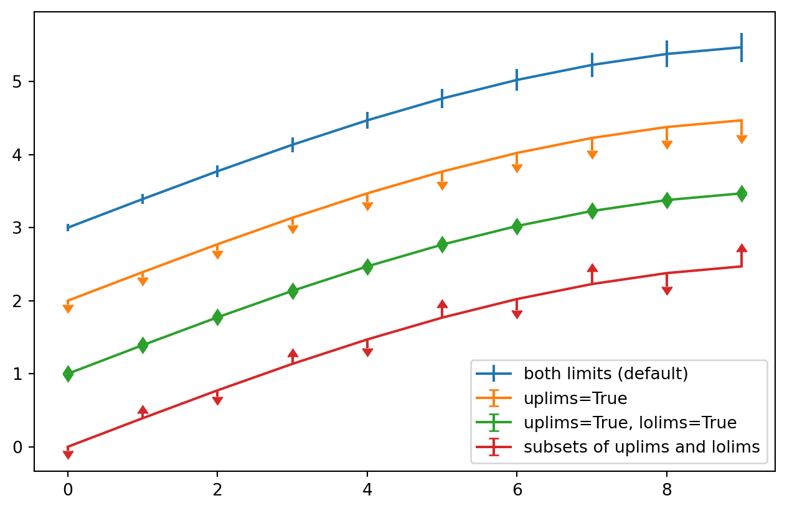

This blog post pertains to things and stuff, and hopefully
learning a lot about the job of probabalistic programming

<!--more-->

## NumPy

<details>
<summary>Code</summary>

``` python
import numpy as np
a = np.arange(15).reshape(3, 5)
a
```

</details>

    array([[ 0,  1,  2,  3,  4],
           [ 5,  6,  7,  8,  9],
           [10, 11, 12, 13, 14]])

# sasa

## Matplotlib

``` python
import matplotlib.pyplot as plt
from IPython.display import set_matplotlib_formats
# plt.rcParams['axes.facecolor'] = 'none'
%matplotlib inline
# set_matplotlib_formats('svg')
# %config InlineBackend.print_figure_kwargs={'transparent':True}

fig = plt.figure()
x = np.arange(10)
y = 2.5 * np.sin(x / 20 * np.pi)
yerr = np.linspace(0.05, 0.2, 10)

plt.errorbar(x, y + 3, yerr=yerr, label='both limits (default)')
plt.errorbar(x, y + 2, yerr=yerr, uplims=True, label='uplims=True')
plt.errorbar(x, y + 1, yerr=yerr, uplims=True, lolims=True,
             label='uplims=True, lolims=True')

upperlimits = [True, False] * 5
lowerlimits = [False, True] * 5
plt.errorbar(x, y, yerr=yerr, uplims=upperlimits, lolims=lowerlimits,
             label='subsets of uplims and lolims')

plt.legend(loc='lower right')
plt.show(fig)
```



### Daaamn Daniel

``` python
fig2 = plt.figure()
x = np.arange(10)
y = 5.5 * np.sin(x / 20 * np.pi)
yerr = np.linspace(0.05, 0.2, 10)

# plt.errorbar(x, 2*y + 3, yerr=yerr, label='both limits (default)')
# plt.errorbar(x, y + 2, yerr=yerr, uplims=True, label='uplims=True')
plt.errorbar(x, 0.5*y**8 + 1, yerr=yerr, uplims=True, lolims=True,
             label='uplims=True, lolims=True')

upperlimits = [True, False] * 5
lowerlimits = [False, True] * 5
plt.errorbar(x, y, yerr=yerr, uplims=upperlimits, lolims=lowerlimits,
             label='subsets of uplims and lolims')

plt.legend(loc='lower right')
plt.show(fig2)
```


# FROOOOM

hey there[^1]

bloobloo

directly from chemical reactions of emitted precursors. NO(2) is emitted during fuel combustion by all motor vehicles and airplanes. PM(2.5) is emitted by airplanes and, among motor vehicles, mostly by diesel vehicles, such as commercial heavy-duty diesel trucks. Both PM(2.5) and NO(2) are also emitted by fossil-fuel power plants, although PM(2.5) almost exclusively by coal power plants. Observed concentrations at all available ground monitoring sites (240 and 480 for NO(2) and PM(2.5), respectively) were compared between April 2020, the month during which the majority of US states had introduced some measure of social distancing (e.g., business and school closures, shelter-in-place, quarantine), and April of the prior 5 years, 2015--2019, as the baseline. Large, statistically significant decreases in NO(2) concentrations were found at more than 65% of the monitoring sites, with an average drop of 2 parts per billion (ppb) when compared to the mean of the previous 5 years. The same patterns are confirmed by satellite-derived NO(2) column totals from NASA OMI, which showed an average drop in 2020 by 13% over the entire country when compared to the mean of the previous 5 years. PM(2.5) concentrations from the ground monitoring sites, however, were not significantly lower in 2020 than those in the past 5 years and were more likely to be higher than lower in April 2020 when compared with those in the previous 5 years. After correcting for the decreasing multi-annual concentration trends, the net effect of COVID-19 at the ground stations in April 2020 was a reduction in NO(2) concentrations by − 1.3ppb and a slight increase in PM(2.5) concentrations by + 0.28 μg/m(3). The second goal of this study is to explain the different responses of these two pollutants, i.e., NO(2) was significantly reduced but PM(2.5) was nearly unaffected, during the COVID-19 pandemic. The hypothesis put forward is that the shelter-in-place measures affected people's driving patterns most dramatically, thus passenger vehicle NO(2) emissions were reduced. Commercial vehicles (generally diesel) and electricity demand for all purposes remained relatively unchanged, thus PM(2.5) concentrations did not drop significantly. To establish a correlation between the observed NO(2) changes and the extent to which people were actually sheltering in place, thus driving less, we used a mobility index, which was produced and made public by Descartes Labs. This mobility index aggregates cell phone usage at the county level to capture changes in human movement over time. We found a strong correlation between the observed decreases in NO(2) concentrations and decreases in human mobility, with over 4 ppb decreases in the monthly average where mobility was reduced to near 0 and around 1 ppb decrease where mobility was reduced to 20% of normal or less. By contrast, no discernible pattern was detected between mobility and PM(2.5) concentrations changes, suggesting that decreases in personal-vehicle traffic alone may not be effective at reducing PM(2.5) pollution.",2020-10-26,"Archer, Cristina L.; Cervone, Guido; Golbazi, Maryam; Al Fahel, Nicolas; Hultquist, Carolynne",Bull,,,,document_parses/pdf_json/19b253163e5ca4a8393bff84143d8c244dfe41e6.json,document_parses/pmc_json/PMC7586872.xml.json,https://www.ncbi.nlm.nih.gov/pmc/articles/PMC7586872/,
171748:bpxlvpz8,,ArXiv,Changes in air quality and human mobility in the U.S. during the COVID-19 pandemic,,,,arxiv,"The first goal of this study is to quantify the magnitude and spatial variability of air quality changes in the US during the COVID-19 pandemic. We focus on two federally regulated pollutants, nitrogen dioxide (NO2), and fine particulate matter (PM2.5). Observed concentrations at all available ground monitoring sites (240 and 480 for NO2 and PM2.5, respectively) were compared between April 2020 and April of the prior five years, 2015-2019, as the baseline. Large statistically significant decreases in NO2 concentrations were found at more than 65% of the monitoring sites, with an average drop of 2 ppb when compared to the mean of the previous five years. The same patterns are confirmed by satellite-derived NO2 column totals from NASA OMI. PM2.5 concentrations from the ground monitoring sites, however, were more likely to be higher. The second goal of this study is to explain the different responses of the two pollutants during the COVID-19 pandemic. The hypothesis put forward is that the shelter-in-place measures affected peoples' driving patterns most dramatically, thus passenger vehicle NO2 emissions were reduced. Commercial vehicles and electricity demand for all purposes remained relatively unchanged, thus PM2.5 concentrations did not drop significantly. To establish a correlation between the observed NO2 changes and the extent to which people were sheltering in place, we use a mobility index, which was produced and made public by Descartes Labs. This mobility index aggregates cell phone usage at the county level to capture changes in human movement over time. We found a strong correlation between the observed decreases in NO2 concentrations and decreases in human mobility. By contrast, no discernible pattern was detected between mobility and PM2.5 concentrations changes, suggesting that decreases in personal-vehicle traffic alone may not be effective at reducing PM2.5 pollution.",2020-06-27,"Archer, Cristina L.; Cervone, Guido; Golbazi, Maryam; Fahel, Nicolas Al; Hultquist, Carolynne",,,,2006.15279,,,https://arxiv.org/pdf/2006.15279v1.pdf,220250444

329465:0ovs20hk,,WHO,La ética y la moral en anestesiología veterinaria/ Ethics and morals in veterinary anesthesiology/ A ética e a moral em anestesiologia veterinária,,,,unk,"El autor define Ética y Moral y, después de tres décadas de experiencia profesional, discute la Moral y la Ética en las actividades de investigación, didáctica y extensión, observando las posibles distorsiones que ocurren, sugiriendo la conducta técnica y ética que se debe adoptar en cada circunstancia, citando autores antiguos como Hipócrates y René Descartes.",2002,"Massone, Flávio",R. Educ. contin. Med. Vet. Zoot.,,#455067,,,,,143105063
367783:wjzv2z3v,bec15d8b37ba9a53966202f84a24538608b83873,MedRxiv; WHO,The characteristics of multi-source mobility datasets and how they reveal the luxury nature of social distancing in the U.S. during the COVID-19 pandemic,10.1101/2020.07.31.20143016,,,medrxiv,"This study reveals the human mobility from various sources and the luxury nature of social distancing in the U.S. during the COVID-19 pandemic by highlighting the disparities in mobility dynamics from lower-income and upper-income counties. We collect, process, and compute mobility data from four sources: 1) Apple mobility trend reports, 2) Google community mobility reports, 3) mobility data from Descartes Labs, and 4) Twitter mobility calculated via weighted distance. We further design a Responsive Index (RI) based on the time series of mobility change percentages to quantify the general degree of mobility-based responsiveness to COVID-19 at the U.S. county level. We find statistically significant positive correlations in the RI between either two data sources, revealing their general similarity, albeit with varying Pearson r coefficients. Despite the similarity, however, mobility from each source presents unique and even contrasting characteristics, in part demonstrating the multifaceted nature of human mobility. The positive correlation between RI and income at the county level is significant in all mobility datasets, suggesting that counties with higher income tend to react more aggressively in terms of reducing more mobility in response to the COVID-19 pandemic. Most states present a positive difference in RI between their upper-income and lower-income counties, where diverging patterns in time series of mobility changes percentages can be found. To our best knowledge, this is the first study that cross-compares multi-source mobility datasets. The findings shed light on not only the characteristics of multi-source mobility data but also the mobility patterns in tandem with the economic disparity.",2020-08-04,"Huang, X.; Li, Z.; Jiang, Y.; Ye, X.; Den

[^1]: This is supposed to be a footnote
